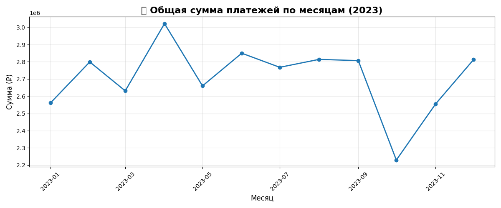

# api-dashboard 

Проект по созданию панели управления с графиками на основе данных получаемых по API, работал в Jupyter Lab.

## Используемые технологии

 * Python
 * API
 * JSON, CSV
 * Pandas, matplotlib
 * SQL(SQLITE)
 * Работа с документациец - Swagger

## Этапы реализации

Какие стояли задачи, подготовительный этапы.

Перед началом разработки были определены следующие задачи и выполнены подготовительные работы:

1. **Анализ требований к проекту**
   - Определение цели: создание панели управления с графиками для визуализации финансовых данных
   - Выявление ключевых метрик для анализа (объем платежей, динамика по месяцам, многолетние тренды)
   - Определение формата вывода результатов (графики, сохранение в файлы)

2. **Выбор технологического стека**
   - Определение языка программирования: Python
   - Выбор библиотек: 
     - `requests` для работы с API
     - `pandas` для обработки данных
     - `matplotlib` для визуализации
     - `sqlite3` для работы с базой данных
   - Выбор среды разработки: Jupyter Lab для интерактивной работы
     
3. **Планирование архитектуры решения**
   - Разработка стратегии загрузки данных (кэширование в JSON, затем переход на SQL)
   - Проектирование структуры базы данных SQLite
   - Определение последовательности этапов: загрузка → обработка → визуализация
   - Планирование автоматизации процессов
     
4. **Настройка окружения**
   - Установка необходимых библиотек Python
   - Создание рабочей директории проекта
   - Настройка подключения к API (проверка доступности, тестирование запросов)
   - Подготовка скриптов для автоматической загрузки данных
     
5. **Определение критериев успеха**
   - Получение корректных данных из API
   - Построение графиков платежей за 2023 год
   - Построение графиков за период 2020-2023
   - Оптимизация хранения данных через переход на SQLite
   - Создание reusable скриптов для дальнейшего использования
     
### 1. Изучение требований и структуры API

На первом этапе была изучена документация API, доступная по адресу: [https://superbank.tryapi.ru/docs](https://superbank.tryapi.ru/docs).

API предоставляет данные по трем основным маршрутам:

*   **`/clients`** — информация о клиентах.
*   **`/accounts`** — информация о банковских счетах и картах.
*   **`/payments`** — данные о совершенных платежах.

**Клиенты** - /clients
```json
{
  "success": true,
  "pagination": {
    "current_page": 1,
    "per_page": 5,
    "total_items": 20000,
    "total_pages": 4000
  },
  "data": [
    {
      "id": 1,
      "fullname": "Данил Калачев",
      "birthday": "1994-04-04",
      "phone": "9566922832",
      "passport": "1864342816",
      "user_id": 38858316
    }
  ]
}
```
**Аккаунты** - /accounts
```json
{
  "success": true,
  "pagination": {
    "current_page": 1,
    "per_page": 5,
    "total_items": 20000,
    "total_pages": 4000
  },
  "data": [
    {
      "id": 1,
      "user_id": 38858316,
      "card_number": "2501800884820631",
      "account_id": "5034733",
      "phone": "9566922832",
      "created_at": 1748751635
    }
  ]
}
```
**Платежи** - /payments
```json
{
  "success": true,
  "pagination": {
    "current_page": 1,
    "per_page": 3,
    "total_items": 20948,
    "total_pages": 6983
  },
  "data": [
    {
      "id": 1,
      "user_id": 38858316,
      "date_pay": "2011-05-16 16:12:33",
      "sum_pay": 61110,
      "source_pay": "2501800884820631",
      "destination_pay": "2501800854108590",
      "created_at": 1305547953
    },
    {
      "id": 2,
      "user_id": 38858316,
      "date_pay": "2015-06-27 06:18:29",
      "sum_pay": 54750,
      "source_pay": "2501800884820631",
      "destination_pay": "2501800865928312",
      "created_at": 1435375109
    }
  ]
}
```


### 2. Загрузка данных в JSON

На начальном этапе данных было не много и для кеширования, решил все данные получить и сохранить в JSON. Написал скрипт для сбора и сохранения данных 
```python
import requests
import time
import json

url = 'https://superbank.tryapi.ru/payments/'
output_file = 'payments.json'

total_pays = []

with open(output_file, 'w', encoding='utf-8') as f:
    for i in range(1, 43):
        params = {'page': i, 'limit': 500}
        try:
            response = requests.get(url, params=params, timeout=10)
            if response.status_code == 200:
                data = response.json()
                for item in data['data']:
                    total_pays.append(item)
                print(f"✓ Страница {i} прочитана")
            time.sleep(1.0)
        except Exception as e:
            print(f"✗ Ошибка на странице {i}: {e}")
    
    json.dump(total_pays, f, ensure_ascii=False)
    

print(f"Готово! Данные в {output_file}") 
```
### 3. Построение графиков и деограм 

Так как стояла задача получить объём платежей за 2023 год, написал скрипт для загрузки данных из JSON, анализа и построения граифка
### **3.1. График платежей за 2023 год**
Для решения этой задачи был написан скрипт, который загружает данные из JSON-файла, фильтрует их по дате, группирует по месяцам и строит линейный график.
```python
import pandas as pd
import matplotlib.pyplot as plt
total_pays = pd.read_json("payments.json")
total_pays['date_pay'] = pd.to_datetime(total_pays['date_pay'])
total_pays.head()

payments_2023 = total_pays[ total_pays['date_pay'].between('2023-01-01', '2023-12-31 23:59:59')]
# payments_2023.head(10)


monthly_sum = payments_2023.groupby(
    payments_2023['date_pay'].dt.to_period('M')
)['sum_pay'].sum().reset_index() 

monthly_sum['month'] = monthly_sum['date_pay'].dt.to_timestamp()

# monthly_sum.head(10)


plt.figure(figsize=(12, 5))
plt.plot(monthly_sum['month'], monthly_sum['sum_pay'], marker='o', linewidth=2)
plt.title(' Общая сумма платежей по месяцам (2023)', fontsize=16, fontweight='bold')
plt.xlabel('Месяц', fontsize=12)
plt.ylabel('Сумма (₽)', fontsize=12)
plt.grid(True, alpha=0.3)
plt.xticks(rotation=45)
plt.tight_layout()
plt.show() 
```
**В результате были получены данные:**


### **3.2. График платежей за 2020–2023 годы**
Для анализа динамики за более длительный период был расширен временной диапазон.
```python
import pandas as pd
import matplotlib.pyplot as plt

total_pays = pd.read_json("payments.json")
total_pays['date_pay'] = pd.to_datetime(total_pays['date_pay'])


payments_2020_2023 = total_pays[total_pays['date_pay'].between('2020-01-01', '2023-12-31 23:59:59')]


monthly_sum = payments_2020_2023.groupby(
    payments_2020_2023['date_pay'].dt.to_period('M')
)['sum_pay'].sum().reset_index()

monthly_sum['month'] = monthly_sum['date_pay'].dt.to_timestamp()


plt.figure(figsize=(14, 6))
plt.plot(monthly_sum['month'], monthly_sum['sum_pay'], marker='o', linewidth=2, color='green')
plt.title('Общая сумма платежей по месяцам (2020-2023)', fontsize=16, fontweight='bold')
plt.xlabel('Месяц', fontsize=12)
plt.ylabel('Сумма (₽)', fontsize=12)
plt.grid(True, alpha=0.3)
plt.xticks(rotation=45)
plt.tight_layout()
plt.savefig('my_total_sum2020_2023.png')
plt.show()
```
Результат — график, демонстрирующий тренд за четыре года:


### 4. Переход на SQL

В ходе работы стало ясно, что JSON не оптимальный вариант. Объем данных растёт, решил переделать на SQL (SQLite). Написмал конвертер API -> SQLite
### **4.1. Конвертер API -> SQLite**
Был написан скрипт, который загружает данные из API и напрямую сохраняет их в таблицу payments в базе данных my_database.db.
```python
import requests
import pandas as pd
import sqlite3
import time

url = 'https://superbank.tryapi.ru/payments/'

page = 1
limit = 500
rows = 0
with sqlite3.connect('my_database.db') as conn:
    cursor = conn.cursor()
    cursor.execute("drop table if exists payments;")

    while True:
        params = {'page': page, 'limit': limit}
        response = requests.get(url,params = params,timeout=10)
        data = response.json()
        df = pd.DataFrame(data['data'])
        if len(data['data']) == 0:
            print("Данные закочились")
            break
        
        rows += df.to_sql('payments', conn,if_exists='append', index=False)
        print(f'Прочитана страница: {page} строк: {rows}')
        time.sleep(1.0)
        page = page + 1
    
print(f'Загружено страниц: {page}, строк: {rows}')
```    

* Для загрузки данных из API в базу данных были разработаны конвертеры для всех трех таблиц:

#### Конвертер для таблицы `payments`

```python
import requests
import pandas as pd
import sqlite3
import time

url = 'https://superbank.tryapi.ru/payments/'

page = 1
limit = 500
rows = 0
with sqlite3.connect('my_database.db') as conn:
    cursor = conn.cursor()
    cursor.execute("drop table if exists payments;")

    while True:
        params = {'page': page, 'limit': limit}
        response = requests.get(url,params = params,timeout=10)
        data = response.json()
        df = pd.DataFrame(data['data'])
        if len(data['data']) == 0:
            print("Данные закочились")
            break
        
        rows += df.to_sql('payments', conn,if_exists='append', index=False)
        print(f'Прочитана страница: {page} строк: {rows}')
        time.sleep(1.0)
        page = page + 1
    
print(f'Загружено страниц: {page}, строк: {rows}')
```

#### Конвертер для таблицы `accounts`
```python
import requests
import pandas as pd
import sqlite3
import time

url = 'https://superbank.tryapi.ru/accounts/'

page = 1
limit = 500
rows = 0
with sqlite3.connect('my_database.db') as conn:
    cursor = conn.cursor()
    while True:
        params = {'page': page, 'limit': limit}
        response = requests.get(url,params = params,timeout=10)
        data = response.json()
        df = pd.DataFrame(data['data'])
        if len(data['data']) == 0:
            print("Данные закочились")
            break
        
        rows += df.to_sql('accounts', conn,if_exists='append', index=False)
        print(f'Прочитана страница: {page} строк: {rows}')
        time.sleep(1.0)
        page = page + 1
    
print(f'Загружено страниц: {page}, строк: {rows}')
```

#### Конвертер для таблицы `clients`
```python
import requests
import pandas as pd
import sqlite3
import time

url = 'https://superbank.tryapi.ru/clients/'

page = 1
limit = 500
rows = 0
with sqlite3.connect('my_database.db') as conn:
    cursor = conn.cursor()

    while True:
        params = {'page': page, 'limit': limit}
        response = requests.get(url,params = params,timeout=10)
        data = response.json()
        df = pd.DataFrame(data['data'])
        if len(data['data']) == 0:
            print("Данные закочились")
            break
        
        rows += df.to_sql('clients', conn,if_exists='append', index=False)
        print(f'Прочитана страница: {page} строк: {rows}')
        time.sleep(1.0)
        page = page + 1
    
print(f'Загружено страниц: {page}, строк: {rows}')
```
    
**График за 2023 год (SQL-версия):**
```python
import pandas as pd
import matplotlib.pyplot as plt
import sqlite3

with sqlite3.connect('my_database.db') as conn:
    
    df = pd.read_sql_query('''
        SELECT 
            STRFTIME('%Y-%m', date_pay) as date_pay, 
            SUM(sum_pay) as total_sum
        FROM payments 
        WHERE date_pay BETWEEN '2023-01-01' and '2023-12-31' 
        GROUP BY STRFTIME('%Y-%m', date_pay);
    ''', conn)
    
plt.figure(figsize=(12, 5))
plt.plot(df['date_pay'], df['total_sum'], marker='o', linewidth=2)
plt.title('Общая сумма платежей по месяцам (2023)', fontsize=16, fontweight='bold')
plt.xlabel('Месяц', fontsize=12)
plt.ylabel('Сумма (₽)', fontsize=12)
plt.grid(True, alpha=0.3)
plt.xticks(rotation=45)
plt.tight_layout()
plt.show() 
```
### **4.2. Построение графиков с использованием SQL-запросов**

После переноса данных в SQLite, скрипты для построения графиков были адаптированы для работы с базой данных. Это позволило выполнять агрегацию и фильтрацию на стороне СУБД, что упростило код и повысило производительность.


### **График за 2020-2023 годы (SQL-версия):**
```python
import sqlite3
import pandas as pd
import matplotlib.pyplot as plt

with sqlite3.connect('my_database.db') as conn:
    df = pd.read_sql_query('''
        SELECT 
            STRFTIME('%Y-%m', date_pay) as date_pay, 
            SUM(sum_pay) as total_sum
        FROM payments 
        WHERE date_pay BETWEEN '2020-01-01' and '2023-12-31' 
        GROUP BY STRFTIME('%Y-%m', date_pay)
        ORDER BY date_pay;
    ''', conn)
    
plt.figure(figsize=(14, 6))
plt.plot(df['date_pay'], df['total_sum'], marker='o', linewidth=2, color='green')
plt.title('Общая сумма платежей по месяцам (2020-2023)', 
          fontsize=16, fontweight='bold')
plt.xlabel('Месяц', fontsize=12)
plt.ylabel('Сумма (₽)', fontsize=12)
plt.grid(True, alpha=0.3)
plt.xticks(rotation=45)
plt.tight_layout()
plt.savefig('my_total_sum2020_2023.png')
plt.show()
```


## Выводы по проекту

В результате был получен набор скриптов для быстрого получения данных по сети и построения графиков по актуальным данным.

Эффективно собирать данные из внешнего API с пагинацией.

Кэшировать и хранить данные — сначала в формате JSON для быстрого прототипирования, затем в реляционной базе данных SQLite для повышения производительности и удобства работы с большими объемами информации.

Автоматизировать построение графиков на основе актуальных данных из базы данных SQLite, используя мощь SQL для агрегации и фильтрации.

Полученные графики позволяют наглядно анализировать динамику платежей, выявлять сезонность и другие тренды, что является основой для создания полноценной панели управления (dashboard).


